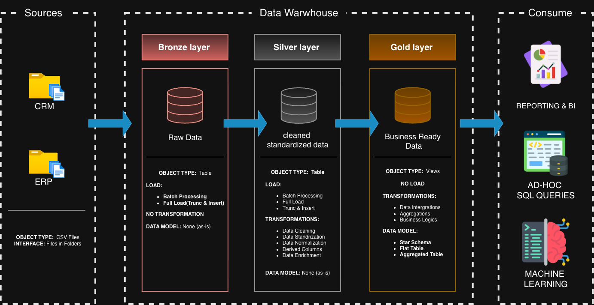
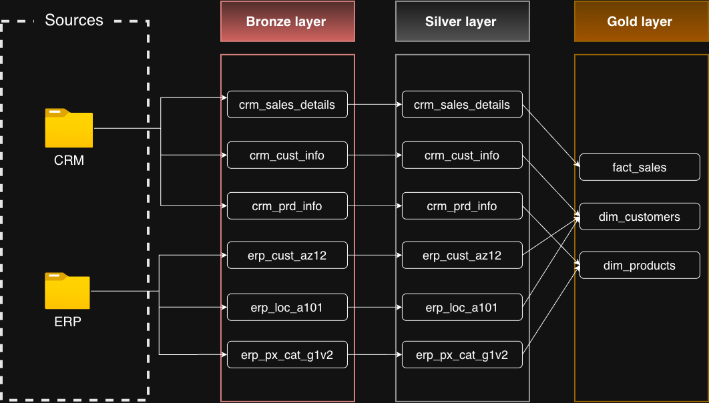

# 🚀 SQL Server Data Warehouse Project

Welcome to the **SQL Server Data Warehouse Project** repository!

This project demonstrates the design and implementation of a modern **SQL Server Data Warehouse** using the **Medallion Architecture (Bronze, Silver, Gold)**. It showcases an end-to-end data engineering workflow, including data ingestion, ETL development, data cleansing, dimensional modeling, and analytics-ready datasets.

The project is designed as a portfolio project to demonstrate practical **Data Engineering**, **SQL**, and **Data Warehousing** skills using industry-standard best practices.

---

# 📌 Project Overview

The objective of this project is to build a scalable and organized data warehouse that integrates data from multiple business systems into a single source of truth for reporting and analytics.

The solution follows the **Medallion Architecture**:

- 🥉 **Bronze Layer** – Raw data ingestion from source systems
- 🥈 **Silver Layer** – Data cleansing, standardization, and transformation
- 🥇 **Gold Layer** – Business-ready dimensional model for analytics

---

# 🎯 Project Objectives

- Build a modern data warehouse using SQL Server.
- Design and implement an end-to-end ETL pipeline.
- Apply the Medallion Architecture.
- Improve data quality through cleansing and validation.
- Integrate ERP and CRM data into a unified analytical model.
- Create optimized fact and dimension tables.
- Produce analytics-ready datasets for reporting and business intelligence.

---

# 📂 Data Sources

This project integrates data from two business systems:

- 📁 **CRM System**
- 📁 **ERP System**

Both datasets are provided as CSV files and loaded into SQL Server.

---

# 🏗️ Data Warehouse Architecture

The project follows the **Medallion Architecture**, where data flows through three logical layers.

- **Bronze Layer** stores raw ERP and CRM data exactly as received.
- **Silver Layer** cleans, validates, standardizes, and enriches the raw data.
- **Gold Layer** builds business-ready dimensional models (Fact and Dimension tables) optimized for analytics.

The Gold layer serves as the single source of truth for:

- 📊 Business Intelligence
- 📈 Reporting
- 🔍 Ad-hoc SQL Queries
- 🤖 Machine Learning

<p align="center">
  
</p>

---

# 🔄 Data Flow Diagram

The following diagram illustrates how data moves through the complete ETL pipeline.

- CRM and ERP systems provide raw CSV datasets.
- Raw data is ingested into the Bronze layer.
- ETL processes clean, validate, standardize, and transform the data in the Silver layer.
- The Gold layer integrates the processed data into a Star Schema consisting of Fact and Dimension tables.

Final analytical tables include:

- **fact_sales**
- **dim_customers**
- **dim_products**

<p align="center">
  
</p>

---

# ⚙️ ETL Process

The ETL pipeline consists of the following stages:

- Import raw CSV files
- Data validation
- Duplicate removal
- Missing value handling
- Data standardization
- Data transformation
- Business rule implementation
- Load into analytical tables

---

# 📊 Data Model

The Gold Layer follows a **Star Schema** dimensional model.

### Dimension Tables

- dim_customers
- dim_products

### Fact Tables

- fact_sales

This model is optimized for analytical queries and reporting.

---

# 📈 Analytics

The final warehouse supports business analysis including:

- Sales Performance Analysis
- Customer Insights
- Product Performance
- Revenue Analysis
- Monthly Sales Trends
- Business KPI Reporting
- Ad-hoc SQL Analysis

---

# 🛠️ Technologies Used

- Microsoft SQL Server
- T-SQL
- ETL
- Medallion Architecture
- Star Schema
- Data Warehousing
- Git
- GitHub

---

# 📁 Repository Structure

```text
sql-data-warehouse-project
│
├── datasets/
├── docs/
│   ├── data_architecture.png
│   └── data_flow_diagram.png
├── scripts/
│   ├── bronze/
│   ├── silver/
│   └── gold/
├── LICENSE
└── README.md
```

---

# 🎓 Skills Demonstrated

- SQL Programming
- Data Engineering
- Data Warehousing
- ETL Pipeline Development
- Data Cleansing
- Data Transformation
- Dimensional Modeling
- Star Schema Design
- Analytical Query Development
- Git Version Control

---

# 🚀 Future Improvements

- Automate ETL pipelines using orchestration tools.
- Implement incremental data loading.
- Add data quality monitoring.
- Build interactive Power BI dashboards.
- Deploy the solution to Azure SQL Database.

---

# 📜 License

This project is licensed under the **MIT License**.

---

# 👨‍💻 About Me

Hi, I'm **Sanjai S**, an aspiring **Data Engineer** passionate about designing scalable data solutions and transforming raw data into meaningful business insights.

Currently focusing on:

- SQL
- Data Engineering
- Data Warehousing
- Python
- Power BI
- Cloud Technologies

If you found this project useful, feel free to ⭐ the repository or connect with me on GitHub.
